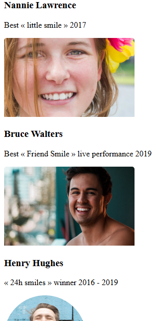

# 🎨 SmileSchool Landing Page Clone

This is a responsive landing page project focused on **CSS styling** using a provided HTML structure. It mimics the SmileSchool page as seen in the Figma design.

> 💡 The goal was to replicate the layout and visuals as closely as possible using modern, semantic CSS techniques.

---

## 🔗 Project Overview

- ✅ Built with semantic **HTML5** structure
- 🎨 Styled using **pure CSS3** (no frameworks)
- 💻 Responsive across desktops, tablets, and mobile
- 🖼️ Assets and layout guided by [Figma design](https://www.figma.com/) 

---

## 🖥️ Preview

### 📍 Before adding css styling

